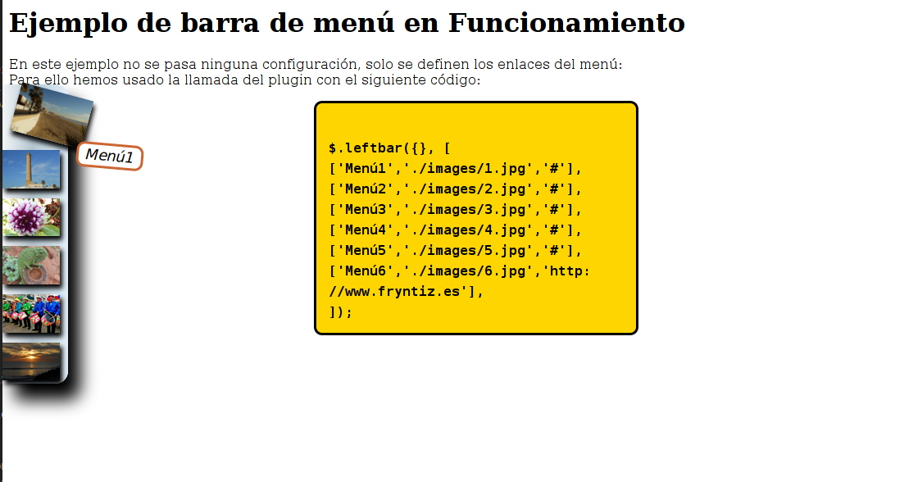

# jquery.leftbar (Versión en pruebas)
Este Plugin JQuery genera en el lateral izquierdo de la pantalla una barra de menú con los nombres y las imágenes que se les pasan.
En estos momentos está recién creado y termino de mejorar su código.



## Objetivos en el desarrollo
- [x] Crear una barra de menú
- [x] Posicionarlo en lateral izquierdo
- [x] Estilos para el menú internos en el plugin
- [x] Imagen con previsualización
- [x] Animar la imagen al pasar el ratón por encima
- [x] Mostrar el título del apartado al pasar el ratón por su imagen
- [x] Llevar a una localización cuando se hace click
- [x] Menú ligeramente enterrado hacia la izquierda, saldrá del todo al pasar ratón por encima de la propia barra o cualquiera de sus elementos

## Descripción

## Visualización

## Parámetros

## Invocación

## Tamaño de las imágenes

## Longitud máxima de título

## Modo de uso
Importa primero la librería jQuery y después este plugin.

Ejemplo:
```html
    <script type="text/javascript" src="./jquery-3.3.1"></script>
    <script type="text/javascript" src="./jquery.leftbar.js"></script>
```
